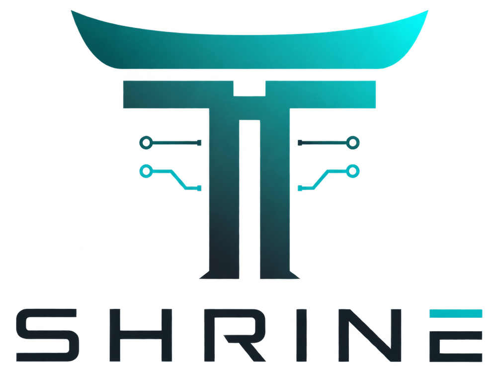

  

<h3>
<em>Stable-Kernel Hosted Reasoning & Inference Network Environment</em>
</h3>

LLM governance and tooling strategy for the org

_**This field has a context window of its own**_: what you knew a month ago isn't wrong, it has simply scrolled out of attention, and the only way to stay in the window is to keep showing up.

This is the org's governance headquarters for both yourself and your agents, a guiding light for those continuing to grow their understanding, and an open forum for how we build with AI in a landscape that reinvents itself every few months. Staying current here isn't a nice-to-have. It's a discipline, and it's one we practice together.

## North Star: TTV (Tokens to Value)

Maximize what every token buys us. Get this right and cost takes care of itself.

- Cutting tokens directly caps capability alongside spend
- Maximizing value per token improves cost *and* quality
- Every tool choice, workflow, and practice we discuss gets measured against TTV

## How This Works

- **The keepers of the shrine** surface direction and hold space for discussion
- **The community shapes what gets built.** This belongs to everyone who uses it
- **Disagreement is welcome.** Nobody sees the whole board alone

[Discussion Threads](https://github.com/stablekernel/the-shrine/discussions)

---

If you've found a tool that changed how you work, a workflow that stopped paying for itself, or a claim that deserves scrutiny, bring it here.
